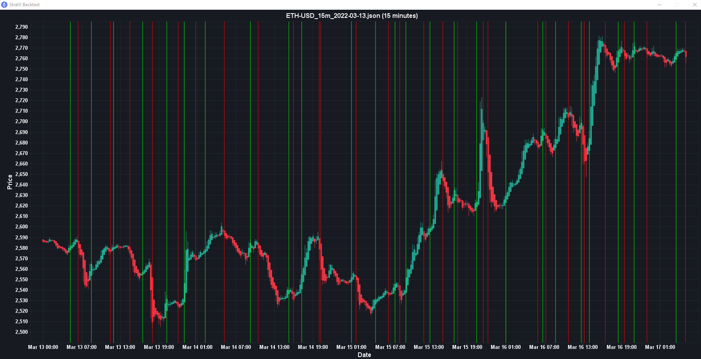

## StratX
#### Crypto trading & strategy testing bot
StratX is a crypto trading bot made in Java.
There are a few modes:
- Downloader
  - Used to download historical data from the exchange,
    can download huge amounts of data.
- Backtesting
  - Used to backtest strategies on downloaded data and show results.
- Simulation (WIP)
  - Used to simulate strategies on live data, without real money. 
- ~~Live trading~~ (TODO)
  - Trade real money on live data. 
> Backtesting Mode

### TODO:

- [x] Config file (Stop Loss, Take Profit, etc)
  - [ ] Config setup GUI?
- [ ] Simulation trading mode
- [ ] Live trading mode
- [ ] Fix backtesting mode (Seems way off compared to simulation)
- [ ] Not sure if we need candle gui anymore, just so glitchy
- [ ] Better and detailed logging
- [ ] Package into executable jar
- [x] Downloader
- [x] Strategies (Containers for indicators)

